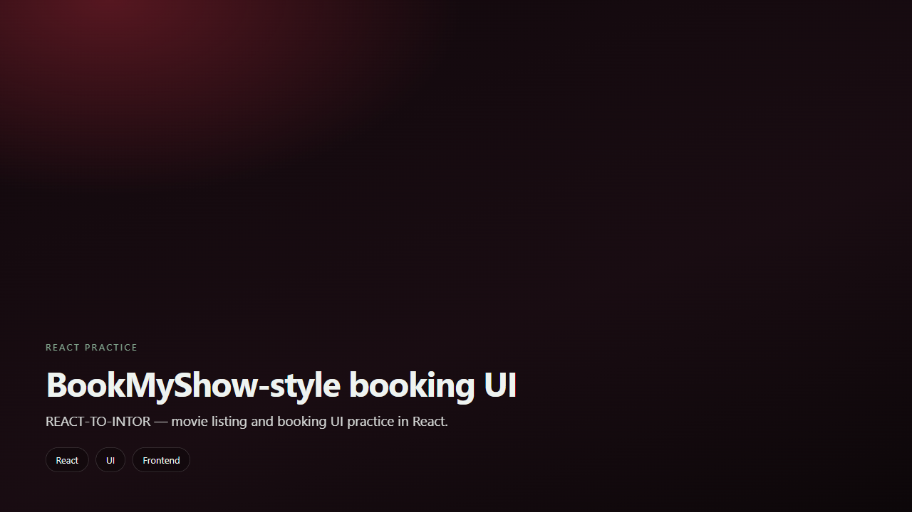

<div align="center">

# REACT-TO-INTOR — Booking UI

**BookMyShow-style movie booking UI practice in React.**

</div>

<div align="center">
  
</div>

---

## Why this exists

A frontend practice project to learn React component structure for movie listing and booking flows.

---

## What you can do

- Movie listing UI
- Booking-style screens
- React component practice
- Static/demo data for learning

---

## Tech stack

| Layer | Technology |
| --- | --- |
| Frontend | React · JavaScript |
| Tooling | Create React App / npm |

---

## Getting started

```bash
git clone https://github.com/Nishanth1409/REACT-TO-INTOR.git
cd REACT-TO-INTOR
npm install
npm start
```

---

## Live & credits

| | |
| :--- | :--- |
| **Author** | [Nishanth K R](https://github.com/Nishanth1409) |
| **Repo** | [Nishanth1409/REACT-TO-INTOR](https://github.com/Nishanth1409/REACT-TO-INTOR) |
| **Portfolio** | [nkrportfolio.vercel.app](https://nkrportfolio.vercel.app) |

---

<div align="center">

*Son of a farmer · always a farmer.*

[GitHub](https://github.com/Nishanth1409) · [Portfolio](https://nkrportfolio.vercel.app)

</div>
