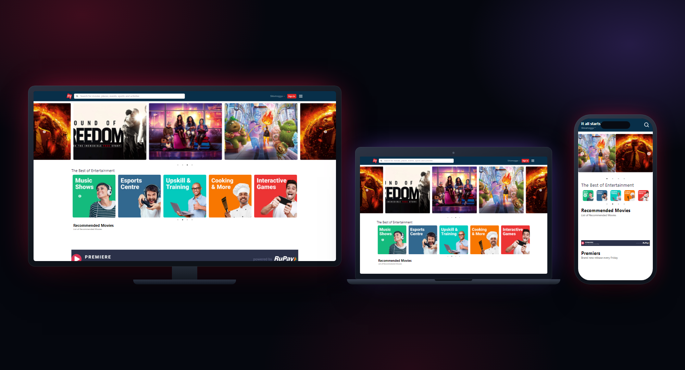
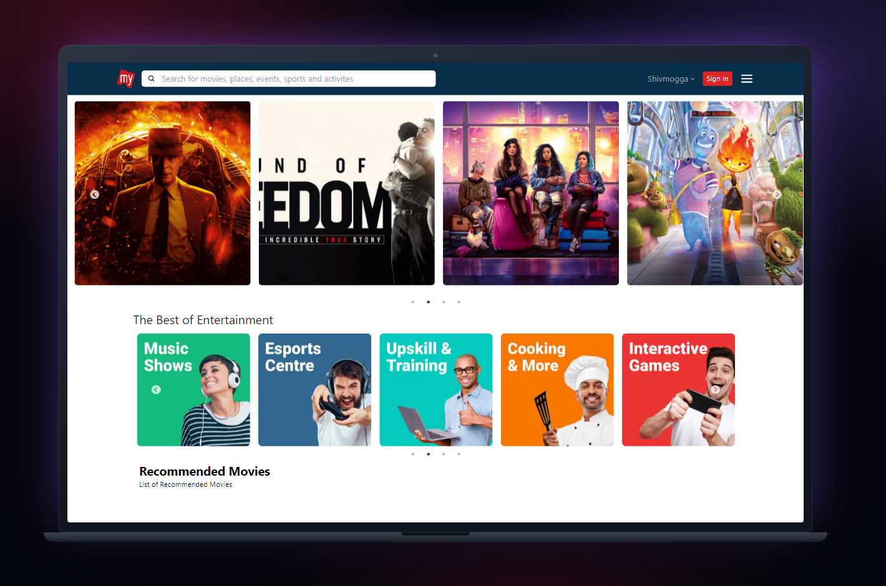
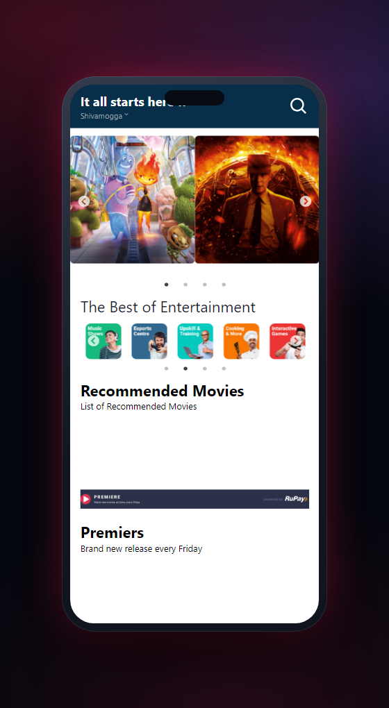
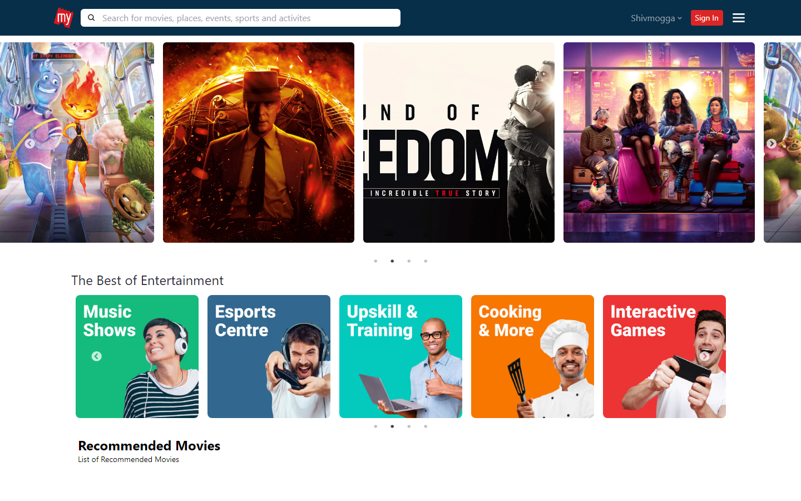
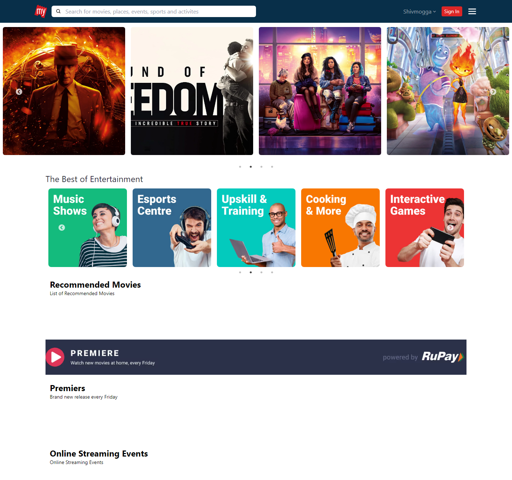

<div align="center">

# Movie Booking UI (BookMyShow-style)

**A React front end for browsing and booking film tickets** — Carousels, category cards, a movie page with cast and similar titles, and a payment modal — built with React Router, context, and Tailwind, running on live data from The Movie Database.

   

[**Live app →**](https://bokmyshow1409.vercel.app/)

</div>

<div align="center">
  
  <p><em>The same app on television, laptop, and phone.</em></p>
</div>

---

## Why this exists

Practice projects get interesting the moment real data arrives. This one pulls live films from The Movie Database, which forces the parts a static clone never reaches: loading states, routing to a detail page by id, sharing the selected film through context, and rendering whatever the API actually returns rather than fixed markup.

> Built by **Nishanth K R** — *son of a farmer, always a farmer.*

---

## What you can do

- **Hero carousel** — A full-width carousel with custom previous and next arrows, built on react-slick.
- **Poster sliders** — Separate rails for recommended, premieres, and upcoming titles, each fed by its own TMDB endpoint.
- **Entertainment categories** — The category card row — music, esports, upskilling, cooking, and games.
- **Movie detail page** — Routed by film id, with the hero, the information panel, cast and crew, and similar titles.
- **Payment modal** — A checkout dialog built with Headless UI, including card and wallet options.
- **Layouts and routing** — A default layout and a movie layout composed through React Router, so page chrome is not repeated.
- **Shared movie context** — The selected film travels through React context instead of being refetched on every page.

> Film artwork and metadata come from The Movie Database (TMDB). This project is not endorsed or certified by TMDB.

---

## See it on every screen

| Laptop · 1440 × 900 | Phone · 390 × 844 |
| :---: | :---: |
|  |  |

---

## The app itself

<div align="center">
  
  <p><em>What you see when the page opens.</em></p>
</div>

<div align="center">
  
  <p><em>The full page, top to bottom.</em></p>
</div>

---

## Tech stack

| Layer | Technology |
| --- | --- |
| Framework | React 18 with Create React App |
| Routing | React Router 7 with layout components |
| Styling | Tailwind CSS |
| Carousels and UI | react-slick · slick-carousel · Headless UI · react-icons |
| Data | axios against The Movie Database API |

---

## Getting started

### 1. Open the live app

Deployed and running with live TMDB data.

### 2. Or clone and install

Node 18 or newer is recommended.

```bash
git clone https://github.com/Nishanth1409/REACT-TO-INTOR.git
cd REACT-TO-INTOR
npm install
```

### 3. Add your TMDB key

Create a .env file with your own key rather than relying on the value in the source.

```text
REACT_APP_TMDB_API_KEY=your_tmdb_key_here
```

### 4. Start the development server

The app opens on port 3000 by default.

```bash
npm start
```

---

## Good to know

<details>
<summary><strong>Do I need my own TMDB key?</strong></summary>

Use your own. Create a free account at themoviedb.org and put the key in REACT_APP_TMDB_API_KEY.

</details>

<details>
<summary><strong>Is this affiliated with BookMyShow?</strong></summary>

No. It is an independent practice project that reproduces a familiar booking interface. All trademarks belong to their owners.

</details>

<details>
<summary><strong>Can I actually book a ticket?</strong></summary>

No. The payment modal is the interface only — there is no payment provider behind it.

</details>

<details>
<summary><strong>Why Create React App?</strong></summary>

It is what the project was started on. The routing, context, and data-fetching work transfers to Vite unchanged.

</details>

---

## Live & credits

| | |
| :--- | :--- |
| **Live** | [bokmyshow1409.vercel.app](https://bokmyshow1409.vercel.app/) |
| **Author** | [Nishanth K R](https://github.com/Nishanth1409) |
| **Repo** | [Nishanth1409/REACT-TO-INTOR](https://github.com/Nishanth1409/REACT-TO-INTOR) |
| **Portfolio** | [nkrportfolio.vercel.app](https://nkrportfolio.vercel.app) |

---

<div align="center">

*Son of a farmer · always a farmer.*

[GitHub](https://github.com/Nishanth1409) · [Portfolio](https://nkrportfolio.vercel.app)

</div>
